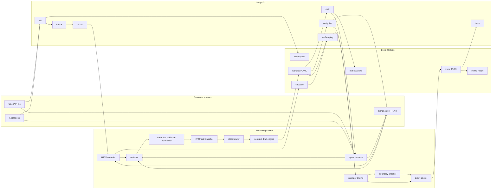
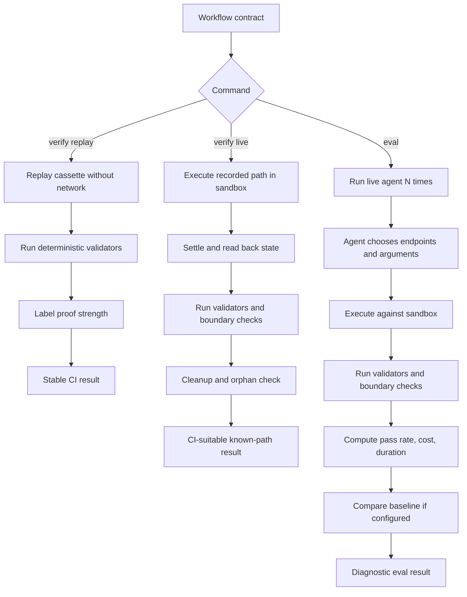
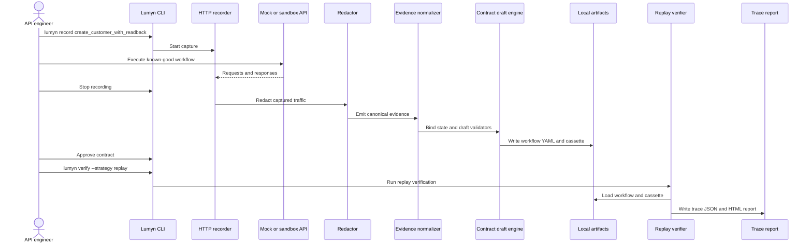

# Lumyn OSS MVP - Product Requirements And Build Spec

| Field | Value |
|-------|-------|
| Version | 1.8 |
| Status | Ready for MVP execution |
| Owner | Product and Engineering |
| Last Updated | 2026-06-10 |
| Primary Audience | Engineers building Lumyn OSS, plus technical founders reviewing scope |
| MVP Scope | Full MVP: record/contract/replay, live verify/boundaries/CI, and live agent eval |

---

## Purpose

This document is the developer-ready MVP PRD for Lumyn OSS.

It narrows the larger Lumyn PRD into the first executable product:

- deterministic workflow recording, contract generation, replay verification, and proof-labeled reports
- live known-path verification, sandbox hygiene, cleanup, basic action boundaries, and CI integration
- live agent eval using the same workflow contracts, validators, boundaries, and evidence model

This document intentionally excludes post-MVP capabilities such as MCP recording, event assertions, coverage dashboards, production trace import, hosted trace history, runtime enforcement, and broad failure-mode clustering. The CI on-ramp — a GitHub Action wrapping `verify`, JUnit output, and a PR-comment summary — is required for the MVP public release because CI integration is the retention loop.

The goal is to give engineering a clear build contract: what to implement, what to defer, what artifacts must exist, what commands must do, and what "done" means.

### Relationship to the master PRD

`lumyn_prd.md` is the strategy and vision source of truth. This document is the build contract derived from it. Where the two differ, this MVP is an intentional, narrower deferral, not a contradiction. The MVP deliberately defers some decisions the master already made, including GraphQL and other body-dispatched API support (operation-level classification and boundaries) and the proof-strength model's `medium` / correlated-event label, which depends on post-MVP event evidence. The master PRD carries the broader strategy; this MVP translates the parts needed for build order, CI retention, and distribution loops into execution scope. When a divergence is load-bearing, this document flags it inline as an explicit MVP deferral. Strategy questions are resolved in the master; build questions are resolved here.

For zero ambiguity:

- the product surface under test is the customer's API and docs surface
- agents are probes, not the primary product being tested
- the core artifact is a versioned workflow contract
- recording is the first authoring experience
- replay verify is the first deterministic CI gate
- live known-path verify is the first meaningful product-regression gate
- live agent eval is diagnostic by default, not the default hard CI gate
- validators and reports consume normalized evidence, not raw transcripts
- proof strength must be visible in every workflow result
- Lumyn must not claim completion when the evidence only proves that an endpoint returned `200`

---

## Executive Summary

Lumyn OSS MVP is a local, repo-native CLI that helps API-first teams answer:

> Can this known workflow be completed against our API/docs surface, can we prove it completed, and can agents rediscover it without unsafe or out-of-scope behavior?

The MVP ships as one complete product scope. The work is organized into three required capability groups for planning and dependency management, but those groups are not separate public releases and none of them is optional for MVP completion.

**Record, contract, replay, and report.** Lumyn ingests OpenAPI and local docs, records a known-good HTTP workflow, drafts a workflow YAML contract, creates a cassette, replay-verifies the contract, and produces a local proof-labeled trace/report.

**Live known-path verify, cleanup, boundaries, and CI.** Lumyn executes the recorded path against a sandbox, handles cleanup and basic isolation, fails if the path no longer reaches the expected outcome or violates configured basic boundaries, and ships a CI on-ramp.

**Live agent eval.** Lumyn runs one configured agent/model as a probe in `surface_only` or `contract_assisted` mode, repeats runs, reports pass rate, wrong turns, cost, duration, validator results, proof strength, and baseline drift warnings.

The MVP's main product insight is:

> A successful API call is not workflow completion. Completion requires evidence.

The MVP's first user-facing aha varies by capability group:

| Capability Group | MVP Aha |
|---|---|
| Record/replay/report | "Our API can perform this workflow, but our surface cannot prove it completed." |
| Live verify/boundaries/CI | "The known-good workflow now breaks in the real sandbox, or reaches success outside the allowed boundary." |
| Live agent eval | "Agents cannot reliably rediscover and complete this workflow from our current API/docs surface, and the trace shows where they fail." |

The MVP is successful only if a technical user can create one durable workflow contract and see one fixable trace without needing a hosted Lumyn account.

---

## Product Thesis

### Job To Be Done

When an API-first company exposes product capabilities to agents through docs, OpenAPI, SDKs, or future MCP tools, it needs to know whether agents can complete important customer workflows correctly, safely, and cheaply before customers discover failures in production. The MVP starts with OpenAPI, local docs, and sandbox HTTP APIs; MCP, SDK, and CLI surfaces are future expansion paths.

### System Under Test

The customer's MVP product surface is the system under test:

- OpenAPI spec
- local docs
- sandbox HTTP API

Future non-MVP surfaces include MCP, SDK, and CLI interfaces.

Agents are probes used to test that surface.

Lumyn must not drift into generic agent testing where the customer's agent is the primary system under test. The MVP should consistently frame failures as product-surface findings unless the evidence only supports a model-specific or stochastic explanation.

### Completion Over Readiness

Lumyn should not lead with a broad "agent readiness score." The MVP must focus on concrete workflows:

```text
workflow goal -> expected outcome -> evidence -> validator result -> proof strength -> trace -> fix target
```

The useful output is not:

```text
Your API is 82% agent ready.
```

The useful output is:

```text
Workflow: create_customer_with_readback
Result: not provable
Proof: gap
Why: POST /customers returned 200, but no reliable read-back confirms status=active.
Fix target: expose or document GET /customers/{id}.status.
```

Source checks and reports should also explain the workflow's high-value business
job when evidence supports it. That framing is not a marketing claim; it is a
grounded statement tied to the workflow goal, expected outcome, validators,
trace, source references, and fix target. This keeps Lumyn focused on
completion proof and continuous CI evidence rather than generation-time
readiness scoring.

### Workflow YAML Is The Source Of Truth

Workflow YAML remains the core durable artifact. The MVP should not require users to start from a blank YAML file.

Expected authoring flow:

```text
record known-good workflow -> Lumyn drafts workflow YAML -> user reviews/edits/approves -> verify/eval uses YAML
```

YAML is a prerequisite for `verify` and `eval`; it is not the first empty screen users should face.

### Safety And Corpus-Ready Evidence

The MVP must keep the developer wedge as concrete workflow completion, but it must also make unsafe completion visible. A workflow that reaches the expected final state while violating a configured `action_boundary` is not a generic DX failure; it is a safety-relevant finding. Reports, traces, JSON output, CI output, and PR comments must preserve enough structure to distinguish:

- completion gaps
- proof gaps
- boundary violations
- redaction/share failures
- eval failures
- model-specific or stochastic failures

Boundary violations that indicate scope escalation, data exposure risk, or out-of-policy action should be labeled as safety/security-relevant findings while avoiding a broad "agent security platform" claim in the MVP.

The MVP must also keep normalized failure evidence portable for a future opt-in corpus and contract/validator registry without uploading private artifacts by default. Normalized result and failure records should preserve fields such as finding kind, proof strength, boundary status, security relevance, fix target, surface fingerprint, provider/model metadata when applicable, eval mode, and a default `corpus_eligible: false` posture. Shared telemetry, hosted failure databases, community registries, and broad failure clustering remain post-MVP.

---

## MVP Required Work

This section is the scope closure target for the MVP. Factory should treat every capability group below as required work for the full MVP. Implementation may still be sequenced internally, but a release or completion claim is not valid until all required groups pass acceptance.

### Record, Contract, Replay, Report

Goal:

```text
OpenAPI + local docs + sandbox/mock HTTP API -> record one workflow -> workflow YAML -> replay verify -> local proof-labeled report
```

Required capabilities:

- `lumyn init`
- `lumyn check`
- `lumyn record`
- `lumyn verify --strategy replay`
- `lumyn trace`
- OpenAPI file intake
- local docs folder intake
- mock HTTP target and starter workflow gallery
- bundled static traces for first-session demo
- HTTP recorder
- capture-time redaction
- canonical trace/evidence schema
- cassette schema
- basic HTTP semantic call classification
- state binding for created IDs and validator inputs
- generated workflow YAML contract
- `api_state` validator
- deterministic, limited `trace_assertion` validator
- proof-strength labels
- local HTML report and JSON trace
- stable exit codes and `--json`

Handled by another required MVP capability group:

- live agent eval
- live known-path verify
- GitHub Action
- JUnit output
- basic action-boundary enforcement

Post-MVP deferrals:

- MCP
- event assertions
- hosted dashboard
- full action-boundary enforcement beyond the basic REST/OpenAPI checks defined here
- workflow recommendation

Live known-path verify, action boundaries, CI, and live agent eval remain required elsewhere in this MVP.

### Live Known-Path Verify, Basic Boundaries, And CI

Goal:

```text
workflow YAML + recorded path + sandbox credentials -> live known-path run -> validator result -> cleanup -> CI-suitable gate
```

Required capabilities:

- `lumyn verify --strategy live`
- sandbox base URL and credential configuration
- run IDs and idempotency keys where practical
- fixture namespace or resource prefix
- live execution of the recorded known-good HTTP path
- settle/retry behavior for eventually consistent read-backs
- cleanup execution
- basic orphan detection
- first-class `action_boundary` object in workflow YAML
- deterministic boundary checks for directly observable evidence
- fail when outcome passes but a configured boundary is violated
- CI on-ramp for the MVP public release: a GitHub Action wrapping `verify`, JUnit-style output, and a PR-comment summary that names changed sources and the workflows they affect

Handled by another required MVP capability group:

- live agent eval in `surface_only` and `contract_assisted` mode

Post-MVP deferrals:

- free-form agent choice
- multi-provider eval panels
- event assertions
- production traffic import
- runtime blocking
- full sandbox orchestration for complex infrastructure workflows

Live agent eval remains required elsewhere in this MVP.

### Live Agent Eval

Goal:

```text
workflow YAML + product sources + sandbox + model config -> live agent attempts -> pass rate, trace, cost, failure evidence
```

Required capabilities:

- `lumyn eval`
- OpenAI-compatible provider adapters, including custom `base_url` local endpoints, and Anthropic provider adapters plus pluggable provider interface
- BYO model key
- model, provider, and temperature pinning
- `surface_only` eval mode
- `contract_assisted` eval mode
- repeated runs
- pass-rate reporting
- selected endpoint/action trace
- wrong-turn trace
- validator results
- action-boundary results where configured
- proof-strength labels
- cost and duration
- saved baseline comparison
- model-snapshot/drift warning where provider support is weak
- diagnostic failure classification
- stateless local agent-run defaults
- allowlisted environment variables
- redaction before trace persistence

Post-MVP deferrals:

- hard eval gate by default
- full multi-provider panels
- LLM judge as deterministic CI gate
- MCP execution
- event assertions
- broad production observability
- hosted scheduling

OpenAI-compatible and Anthropic provider adapters are MVP scope; comparative
multi-provider panels remain post-MVP. Local open-source model servers are
supported through the OpenAI-compatible `base_url` path when configured; Lumyn
does not bundle model weights or local inference-runtime payloads.

---

## MVP User

### Primary User

API, DX, platform, integrations, docs, or DevRel engineer at an API-first B2B software company.

They usually have:

- public or internal OpenAPI spec
- local docs or docs repo
- sandbox API key
- a few high-value customer workflows
- increasing pressure to make APIs usable by agents

They may not have:

- a clean API surface
- reliable read-backs for every workflow
- model keys available in the first session
- time to hand-author complex YAML
- a hosted Lumyn account

### First MVP Workflow

Start with simple HTTP workflows that have cheap cleanup and clear read-backs:

- create customer and verify status
- create API key and verify metadata
- invite user and verify pending state
- update subscription and verify plan/status
- create webhook configuration and verify it is enabled, but not event delivery yet

Avoid first:

- infrastructure onboarding
- cloud account mutation
- payments reversal
- async event delivery
- broad customer data export
- destructive admin workflows

---

## Command Model

`lumyn` is the only primary command surface.

### Commands

| Command | MVP Requirement |
|---|---|
| `lumyn init` | Required |
| `lumyn check` | Required |
| `lumyn record` | Required |
| `lumyn verify --strategy replay` | Required |
| `lumyn verify --strategy live` | Required |
| `lumyn eval` | Required |
| `lumyn trace` | Required |

Do not ship `lumyn test` in the MVP. It blurs deterministic verification and stochastic eval.

Auxiliary commands:

| Command | MVP Requirement |
|---|---|
| `lumyn demo` | Required |
| `lumyn share` | Required |

`lumyn demo` and `lumyn share` are distribution and sharing helpers. They do not change the primary command surface, and they must still obey the same redaction, proof-honesty, and exit-code contracts.

### First-Session Commands

```bash
lumyn demo
lumyn init --openapi ./openapi.yaml --docs ./docs
lumyn check
lumyn record create_customer_with_readback
lumyn verify workflows/create-customer-with-readback.yaml --strategy replay
lumyn trace runs/<run-id>/trace.json
```

### Exit Codes

Every command that returns state must support `--json`.

Stable exit codes:

- `0`: success
- `1`: general or internal error
- `2`: invalid usage, invalid input, parse error, or local configuration error
- `3`: source completeness failure in strict mode
- `4`: workflow contract validation failure
- `5`: workflow verification failure
- `6`: live agent eval failed an explicitly configured regression or threshold gate
- `7`: credential, auth, or environment error
- `8`: dependency, model provider, or network error
- `9`: trace, cassette, or replay integrity failure

### JSON Envelope

Every command that returns state should emit:

```json
{
  "object_type": "lumyn.command_result",
  "schema_version": "1.0",
  "command": "verify",
  "status": "pass",
  "mode": "verify",
  "warnings": [],
  "errors": [],
  "artifacts": [],
  "duration_ms": 0,
  "redaction_status": "applied",
  "finding_kind": "none",
  "proof_strength": "unknown",
  "action_boundary_status": "not_configured",
  "security_relevance": "none",
  "fix_target": "not_applicable",
  "surface_fingerprint": "not_applicable",
  "eval_mode": "not_applicable",
  "provider_metadata": {
    "applicable": false,
    "provider": "not_applicable",
    "model": "not_applicable"
  },
  "corpus_eligible": false
}
```

Workflow runs should additionally include:

- `workflow_id`
- `run_id`
- `verify_strategy`
- `eval_context_mode` when mode is `eval`
- `result_axes`
- workflow-specific `proof_strength` and `action_boundary_status` values when
  stronger evidence or configured boundaries are available
- `failure_modes`
- `trace_path`
- `report_path`
- `cost_estimate_usd` when live model use occurs
- `model` and `model_snapshot` when available
- `baseline_ref` when compared

---

## Project Configuration

Example `lumyn.yaml`:

```yaml
version: 1

sources:
  openapi:
    - id: public_api
      path: ./openapi.yaml
  docs:
    - id: docs
      path: ./docs

env:
  base_url: ${API_BASE_URL}
  api_key: ${LUMYN_API_KEY}

redaction:
  headers:
    - authorization
    - x-api-key
  fields:
    - access_token
    - refresh_token
    - secret
    - password

verify:
  default_strategy: replay
  replay:
    allow_network: false
  live:
    base_url: ${API_BASE_URL}
    settle_timeout_seconds: 30
    retry_readbacks: true
    cleanup: true

eval:
  default_context_mode: surface_only
  runs: 3
  model:
    provider: openai # or anthropic
    model: gpt-5
    temperature: 0
  agent_runs:
    stateless: true
    allow_ambient_workspace_access: false
    allowed_env:
      - API_BASE_URL
      - LUMYN_API_KEY
    network_allowlist:
      - ${API_BASE_URL}
```

---

## Workflow Contract

### Contract Purpose

The workflow contract is the durable MVP artifact.

It must be:

- human-readable
- version-controlled
- generated by recording where possible
- editable by an engineer
- executable by replay verify, live known-path verify, and live agent eval
- explicit about proof strength and evidence gaps

### Minimal Contract

```yaml
version: 1
id: create_customer_with_readback
goal: Create a customer and verify the customer is active.

expected_outcome:
  type: action_completed

context:
  sources:
    - public_api
    - docs
  required:
    - customer lifecycle states
    - required auth scope for customer creation

constraints:
  max_requests: 20
  max_duration_seconds: 120

state_bindings:
  customer_id:
    from: steps.create_customer.response.body.id

steps:
  - id: create_customer
    intent: Create a customer.
    validators:
      - type: trace_assertion
        expect:
          did_not_call_forbidden_paths: true
          did_not_expose_secrets: true

  - id: verify_customer
    intent: Verify the customer exists and is active.
    validators:
      - type: api_state
        request:
          method: GET
          path: /customers/{customer_id}
        expect:
          status: active

validators:
  - type: api_state
    request:
      method: GET
      path: /customers/{customer_id}
    expect:
      status: active

cleanup:
  - method: DELETE
    path: /customers/{customer_id}
```

### Boundary Extension

```yaml
action_boundary:
  allowed_paths:
    - /customers
    - /customers/{customer_id}
  forbidden_paths:
    - /admin/*
    - /customers/export
  # Reserved for post-MVP body-dispatched APIs (GraphQL, JSON-RPC, gRPC).
  # Operation-level enforcement does not exist in the MVP. These must stay
  # empty: a non-empty value fails `lumyn check` (exit 4) unless the field
  # is explicitly marked experimental, in which case the run reports
  # boundary_status: declared_not_enforced and never passed.
  allowed_operations: []
  forbidden_operations: []
  allowed_scopes:
    - customers:read
    - customers:write
  forbidden_scope_escalation: true
  resource_scope:
    customer_id: "{customer_id}"
  max_requests: 20
  max_write_operations: 1
  secret_exposure: fail
```

### Eval Extension

```yaml
eval:
  context_modes:
    - surface_only
    - contract_assisted
  runs: 3
  gate:
    enabled: false
  baseline:
    ref: baselines/create_customer_with_readback.json
```

### Contract Rules

- A minimal contract must include `id`, `goal`, `expected_outcome`, and at least one validator.
- Generated contracts must be reviewed and approved before becoming stable.
- Generated validators must be labeled `accepted`, `suggested`, `needs_user_input`, or `coverage_gap`.
- Outcome validators are preferred over path validators.
- Path validators are allowed only when the path itself is a product requirement.
- Contracts must not claim strong proof when only trace evidence exists.
- When both `constraints` and `action_boundary` set the same limit such as `max_requests`, the stricter (lower) value applies. `constraints` are pre-flight execution budgets; an `action_boundary` breach is a safety finding that fails the workflow even if the outcome passed.
- Per-workflow `eval` settings in the contract override the project `eval` defaults in `lumyn.yaml`; any field not set in the contract inherits the project default.
- Declared controls must never be silently unenforced. If a contract declares a control Lumyn cannot enforce in the MVP — for example non-empty `allowed_operations` or `forbidden_operations` while operation-level enforcement is post-MVP — `lumyn check` must fail contract validation (exit 4) with a message naming the unenforced control. A user may opt in to forward-authoring by marking the field `experimental: true`, but then the run must report `boundary_status: declared_not_enforced` (never `passed`) and surface it prominently. Lumyn must never report a declared control as satisfied when it is not enforced; this is the boundary analog of never claiming confirmed read-back proof from trace-only evidence.
- Unresolved or ambiguous state bindings must fail closed. If a binding such as `{customer_id}` cannot be resolved from a prior step, `lumyn check` or `verify` must fail (exit 4 or 5) before execution rather than silently substituting an empty value into a request, validator, or cleanup path. A binding that collapses `GET /customers/{customer_id}` to `GET /customers/` can pass spuriously and is a contract failure, not a warning.

---

## Core Artifacts

MVP artifact layout:

```text
lumyn.yaml
schemas/
  workflow-contract.schema.json
  expected-outcome.schema.json
  validator.schema.json
  action-boundary.schema.json
  human-annotation.schema.json
  required-context.schema.json
  state-binding.schema.json
  canonical-trace.schema.json
  evidence-event.schema.json
  cassette.schema.json
  result-axes.schema.json
  proof-strength.schema.json
  command-result.schema.json
  redaction-config.schema.json
examples/
  mock-api/
  traces/
    agent-failure.json
    proof-gap.json
  workflows/
    create-customer-with-readback.yaml
    create-customer-proof-gap.yaml
workflows/
  create-customer-with-readback.yaml
cassettes/
  create-customer-with-readback.json
baselines/
  create-customer-with-readback.json
runs/
  <run-id>/
    trace.json
    report.html
```

Required schemas:

- `WorkflowContract`
- `ExpectedOutcome`
- `Validator`
- `ActionBoundary`
- `HumanAnnotation`
- `RequiredContext`
- `StateBinding`
- `CanonicalTrace`
- `EvidenceEvent`
- `Cassette`
- `ResultAxes`
- `ProofStrength`
- `CommandResult`
- `RedactionConfig`

---

## System Model

### Architecture Spine

```text
sources
-> source checks
-> recording
-> redaction
-> canonical evidence
-> state bindings
-> workflow contract
-> validators
-> proof strength
-> trace/report
-> replay/live/eval results
```

### Core Components

| Component | Responsibility | MVP Workstream |
|---|---|---|
| CLI | Command parsing, config loading, artifact paths, exit codes | Core CLI |
| Source parser | OpenAPI and local docs intake | Source intake |
| Source checker | Agent-relevant source checks | Source intake |
| HTTP recorder | Capture known-good HTTP traffic | Record/replay |
| Redactor | Remove secrets before persistence | Evidence pipeline |
| Evidence normalizer | Convert raw traffic into canonical events | Evidence pipeline |
| Call classifier | Classify HTTP method, path, operation, read/write, request/write counts | Evidence pipeline |
| State binder | Extract IDs and bind them across validators/cleanup | Evidence pipeline |
| Contract draft engine | Draft workflow YAML from recording | Workflow contract |
| Validator engine | Run `api_state` and limited `trace_assertion` | Validation |
| Replay runner | Validate contracts and cassettes without network | Record/replay |
| Live known-path runner | Execute recorded path against sandbox | Live verify |
| Sandbox manager | Namespaces, cleanup, idempotency, orphan detection | Live verify |
| Boundary checker | Deterministic basic action-boundary checks | Boundary enforcement |
| Agent harness | Run live agent probe with configured model | Live agent eval |
| Baseline comparator | Compare eval against saved baseline | Live agent eval |
| Report renderer | Local HTML report and JSON trace | Reporting |

### Canonical Evidence Event

Canonical evidence events are the shared substrate for record, replay verify, live known-path verify, eval, validators, and reports.

Example:

```json
{
  "object_type": "lumyn.evidence_event",
  "schema_version": "1.0",
  "event_id": "evt_001",
  "run_id": "run_123",
  "timestamp": "2026-06-07T00:00:00Z",
  "source": "http",
  "kind": "http_request",
  "redaction_status": "applied",
  "raw_refs": ["redacted://request/evt_001"],
  "classification": {
    "action_type": "write",
    "confidence": "high"
  },
  "operation": {
    "method": "POST",
    "path": "/customers",
    "operation_id": "createCustomer",
    "action_type": "write",
    "classification_confidence": "high"
  },
  "request": {
    "headers_redacted": true,
    "body_ref": "redacted://request/evt_001"
  },
  "response": {
    "status_code": 200,
    "body_ref": "redacted://response/evt_001"
  },
  "bindings": {
    "customer_id": "cus_test_123"
  },
  "confidence": "high",
  "finding_kind": "none",
  "proof_strength": "unknown",
  "action_boundary_status": "not_configured",
  "security_relevance": "none",
  "fix_target": "not_applicable",
  "surface_fingerprint": "not_applicable",
  "eval_mode": "not_applicable",
  "provider_metadata": {
    "applicable": false,
    "provider": "not_applicable",
    "model": "not_applicable"
  },
  "corpus_eligible": false,
  "metadata": {}
}
```

---

## Product Surfaces

### 1. Source Intake And Check

`lumyn init` and `lumyn check` must ingest OpenAPI and local docs.

MVP source checks:

- OpenAPI parses
- operations have summaries/descriptions where agent tool choice depends on them
- request schemas exist for mutating operations
- response schemas exist for validator read-backs
- parameters have useful descriptions
- auth schemes are present
- auth scopes are documented where visible
- deprecated operations have replacement guidance
- near-duplicate operations are distinguishable
- pagination, retry, rate-limit, and idempotency guidance exists where relevant
- local docs can be read
- broken local references are reported where practical

Source checks must produce file, path, or object references.

They must not become a generic OpenAPI linter. Findings should be workflow-relevant where possible.

### 2. Record

`lumyn record <workflow_id>` records a known-good HTTP workflow.

The recorder must:

- capture requests and responses
- redact before writing artifacts
- normalize evidence events
- classify HTTP calls
- extract IDs and state bindings
- identify read-back candidates
- draft validators
- draft cleanup suggestions
- capture one human pass/fail justification
- produce draft-quality metadata

The recorder should ask the user for missing context when traffic alone is insufficient:

- why this workflow passes
- what final state matters
- what similar endpoint would be wrong
- what auth scope is expected
- what resources are out of scope

### 3. Verify

`lumyn verify` has two strategies.

`replay`:

- default deterministic CI strategy
- no network
- serves recorded evidence from cassette
- validates cassette integrity, state bindings, validators, result axes, and proof labels
- cannot catch live product regressions
- must warn, and fail in strict mode, when the recorded source version differs from the current source, so a green replay on changed sources is never mistaken for a product-surface guarantee (a stale replay would otherwise return a silent green in CI)

`live`:

- CI-suitable live product-regression strategy
- executes recorded known-good path against sandbox
- uses live read-backs
- supports settle/retry behavior
- executes cleanup
- fails on configured boundary violations
- can catch real product-surface regressions for known paths

### 4. Eval

`lumyn eval` ships in the MVP.

It runs live agents as probes against the product surface.

Context modes:

- `surface_only`: agent gets OpenAPI/docs and must rediscover the workflow from the product surface
- `contract_assisted`: agent also gets required workflow context from the contract

Eval output must include:

- run count
- pass rate
- model/provider/temperature
- model snapshot where available
- source set
- selected endpoints
- wrong turns
- validator results
- boundary results
- proof strength
- failure class
- cost
- duration
- baseline comparison where configured
- drift warning where snapshots are unavailable

Eval is diagnostic by default. Hard eval gates require explicit configuration.

### 5. Trace And Report

`lumyn trace` opens or exports a local trace/report.

The first screen must answer:

```text
Workflow
Result
Proof strength
Why
Evidence
Fix target
Next command
```

The report must show result axes separately:

- outcome
- path
- context
- boundary
- cleanup
- proof strength

The report must make weak proof visible. A workflow that only proves "the expected endpoint was called" should not look equivalent to one confirmed by a reliable read-back.

---

## Validators

### MVP Validators

| Validator | MVP Requirement | Purpose |
|---|---|---|
| `api_state` | Required | Confirm product state through read-back |
| `trace_assertion` | Required | Check directly observable trace invariants |
| `action_boundary` checks | Required | Fail when configured boundaries are violated |

### `api_state`

`api_state` validates final or step-level product state using a configured request.

Proof strength:

- strong: reliable read-back confirms expected business state
- gap: no reliable read-back exists

Workflow proof strength is the weakest proof strength among required outcome validators: a single required validator at `gap` makes the workflow `gap`, and a single trace-only (`weak`) validator caps the workflow at `weak`, unless the contract explicitly marks that validator advisory. Lumyn must never report aggregate `strong` when a required outcome validator is weaker.

### `trace_assertion`

MVP `trace_assertion` is a fixed vocabulary, not a general DSL.

Allowed MVP checks:

- forbidden path was not called
- deprecated path was not called
- secret was not exposed
- request budget was not exceeded
- write-operation budget was not exceeded
- expected state binding was present

Do not use trace assertions to force one blessed path unless that path is explicitly required for safety or product semantics.

### Action-Boundary Checks

The MVP adds a first-class `action_boundary` object.

Boundary checks are deterministic over observed evidence:

- allowed/forbidden paths
- allowed scopes where visible
- forbidden scope escalation where visible
- resource scope
- request budget
- write-operation budget
- secret exposure

The MVP enforces path-based boundaries because it targets REST/OpenAPI surfaces. Body-dispatched APIs (GraphQL, JSON-RPC, gRPC) are deferred to post-MVP, but the `action_boundary` schema reserves `allowed_operations` and `forbidden_operations` so operation-level enforcement can be added without re-architecting boundaries. Until then, a single-endpoint body-dispatched call that cannot be resolved to an operation should be reported as `classification_uncertain` rather than treated as in-bounds.

If final state passes but the boundary fails, the workflow fails.

Boundary results use explicit statuses and must never overclaim: `passed` only when a configured boundary was actually checked and held; `failed` on violation; `not_configured` when no boundary is set; `declared_not_enforced` when a boundary is declared but the current build cannot enforce it. `not_configured` and `declared_not_enforced` must never render as `passed`.

Budget checks must fail closed under classification uncertainty. When a call's read/write class is uncertain — for example a side-effecting `GET` — `max_write_operations` enforcement must count it as a write or mark `classification_uncertain`, never silently treat it as a read.

---

## Failure Taxonomy

Initial MVP failure classes:

- `source_missing_metadata`
- `docs_ambiguous`
- `context_missing`
- `wrong_tool_or_endpoint`
- `auth_confusion`
- `final_state_mismatch`
- `validator_coverage_gap`
- `proof_gap`
- `forbidden_endpoint_call`
- `scope_escalation`
- `unrelated_resource_access`
- `unexpected_write_action`
- `excessive_api_calls`
- `data_exposure_risk`
- `cleanup_failure`
- `model_specific_failure`
- `flaky_workflow`
- `baseline_drift_contaminated`
- `classification_uncertain`
- `unenforced_boundary_declared`

Failure summaries must reference concrete evidence. Lumyn should not present unsupported LLM diagnosis as fact.

---

## Functional Requirements

### FR1: Product Surface Under Test

Lumyn must frame the customer's API/docs surface as the system under test and agents as probes.

### FR2: Local-First Operation

The MVP must work without a hosted Lumyn account.

### FR3: OpenAPI And Local Docs Intake

Lumyn must ingest an OpenAPI file and local docs folder.

### FR4: Agent-Relevant Source Checks

Lumyn must run structural checks that affect agent tool choice, validation, auth handling, retries, and workflow proof.

### FR5: Workflow Contract Schema

Lumyn must define a versioned YAML workflow contract with goal, expected outcome, validators, state bindings, context, constraints, and cleanup.

### FR6: Recording As Authoring

Lumyn must record known-good HTTP traffic and draft workflow contracts, validators, state bindings, cassettes, and cleanup suggestions.

### FR7: User Approval

Generated workflow contracts must be editable and approved before being treated as stable.

### FR8: Capture-Time Redaction

Secrets must be redacted before requests, responses, cassettes, traces, or reports are persisted.

### FR9: Canonical Evidence Schema

Record, replay verify, live verify, eval, validators, and reports must consume canonical evidence events.

### FR10: Replay Verify

Lumyn must support deterministic replay verification without network calls.

### FR11: API State Validation

Lumyn must support `api_state` validators and explicit proof-gap reporting when no reliable read-back exists.

### FR12: Trace Assertions

Lumyn must support a limited deterministic `trace_assertion` vocabulary.

### FR13: Local Trace And Report

Lumyn must produce a local JSON trace and HTML report.

### FR14: Stable CLI Output

Lumyn must support stable exit codes and `--json`.

### FR15: Live Known-Path Verify

Lumyn must support live known-path verification against sandbox.

### FR16: Cleanup And Sandbox Hygiene

Lumyn must support cleanup steps, run IDs, idempotency where practical, and basic orphan detection.

### FR17: Action Boundary

Lumyn must support a first-class action-boundary object and deterministic boundary checks.

### FR18: Boundary Failure Semantics

Lumyn must fail a workflow when expected final state passes but configured action boundaries are violated.

### FR19: Live Agent Eval

Lumyn must support live agent probes using OpenAI-compatible provider adapters,
including custom `base_url` local endpoints, and Anthropic provider adapters
behind a pluggable provider interface.

### FR20: Eval Context Modes

Lumyn eval must support `surface_only` and `contract_assisted` modes.

### FR21: Eval Repetition

Lumyn eval must support repeated runs and report pass rate instead of hiding stochastic behavior.

### FR22: Model Pinning

Lumyn must record provider, model, temperature, and model snapshot where available.

### FR23: Baseline Comparison

Lumyn eval must compare against a saved baseline where configured and label drift risk when model snapshots are unavailable.

### FR24: Least-Privilege Agent Runs

Lumyn eval must default to stateless local runs, explicit context, allowlisted env vars, and no ambient workspace access.

### FR25: Portable Artifacts

Workflow contracts, cassettes, traces, reports, and baselines must remain useful outside a hosted service.

---

## Non-Functional Requirements

### NFR1: Fast First Value

A technical user should run `init`, `check`, and open bundled traces in under 10 minutes.

### NFR2: Fast First Workflow

A technical user should record and replay-verify one simple workflow in under 30 minutes.

### NFR3: Deterministic Replay

Repeated replay verification on unchanged artifacts must produce the same result.

### NFR4: Proof Honesty

Reports must clearly distinguish confirmed read-back proof, trace-only evidence, and proof gaps.

### NFR5: Security

Redaction must happen before artifact persistence. If a value cannot be confidently redacted, Lumyn must fail closed: mark the artifact unsafe to persist rather than write a possibly-unredacted secret. Silent persistence of an unrecognized secret is a trust bug, not an edge case.

### NFR6: Local Privacy

Lumyn must not send specs, docs, traces, cassettes, or API responses to Lumyn by default.

### NFR7: Contract Readability

Workflow YAML must be understandable by engineers without a custom UI.

### NFR8: Parser-First

OpenAPI checks should use structured parsers and schema-aware libraries where possible.

### NFR9: Debuggable Errors

Errors must include file, path, command, object, or line references where possible.

### NFR10: Cost Visibility

Live evals must show token and estimated cost information.

### NFR11: Stochastic Honesty

Eval must report run counts and pass rates. It must not hide variability behind a deterministic-looking boolean.

### NFR12: Artifact Stability

Schemas and artifacts must be versioned.

### NFR13: Inference Humility

Recorder-generated validators, bindings, boundaries, and cleanup suggestions must be confidence-labeled.

### NFR14: No Dashboard Dependency

The MVP must explain value through local CLI output and local reports.

---

## Scope

### MVP In Scope

- local OSS CLI
- OpenAPI file intake
- local docs intake
- source checks
- workflow YAML schema
- known-good HTTP recording
- capture-time redaction
- canonical evidence schema
- cassette schema
- state binding
- contract draft generation
- `api_state`
- limited `trace_assertion`
- replay verify
- live known-path verify
- sandbox cleanup and basic orphan detection
- basic action-boundary object and checks
- live agent eval with OpenAI-compatible provider adapters, including custom `base_url` local endpoints, and Anthropic provider adapters
- surface-only and contract-assisted eval
- repeated eval runs
- baseline comparison
- local JSON trace
- local HTML report
- stable exit codes
- `--json`
- bundled mock target
- bundled static traces
- `lumyn demo` zero-install demo and one-click `lumyn share` trace export
- CI on-ramp: GitHub Action wrapping `verify`, JUnit output, and a PR-comment summary
- proof-honest README badge generated from the JSON command result

### MVP Out Of Scope

- MCP intake or recording
- event assertions
- docs URL crawler
- hosted dashboard
- hosted trace history
- scheduled evals
- production trace import
- automatic failure clustering
- automatic remediation PRs
- workflow recommendation as hero feature
- generic agent eval platform
- broad agent security platform
- vector database dependency
- runtime enforcement
- API gateway or MCP gateway behavior
- full multi-provider panels
- LLM judge as default gate
- broad enterprise knowledge management
- training shared models on private specs, docs, cassettes, traces, or responses

---

## Phase 0 Product Contracts

Phase 0 produces product contracts, not broad implementation. These contracts define what engineers must build before the recorder spike starts. The executable `.schema.json` files live under `schemas/`; this section defines the normative shape they must satisfy.

### Artifact Layout Contract

Phase 0 must preserve this local-first layout:

```text
lumyn.yaml
schemas/
  workflow-contract.schema.json
  expected-outcome.schema.json
  validator.schema.json
  action-boundary.schema.json
  human-annotation.schema.json
  required-context.schema.json
  state-binding.schema.json
  canonical-trace.schema.json
  evidence-event.schema.json
  cassette.schema.json
  result-axes.schema.json
  proof-strength.schema.json
  command-result.schema.json
  redaction-config.schema.json
examples/
  mock-api/
  traces/
    agent-failure.json
    proof-gap.json
  workflows/
    create-customer-with-readback.yaml
    create-customer-proof-gap.yaml
workflows/
  <workflow-id>.yaml
cassettes/
  <workflow-id>.json
baselines/
  <workflow-id>.json
runs/
  <run-id>/
    trace.json
    report.html
```

User-authored or user-approved artifacts:

- `lumyn.yaml`
- `workflows/*.yaml`
- optional eval baselines

Generated artifacts:

- `cassettes/*.json`
- `runs/<run-id>/trace.json`
- `runs/<run-id>/report.html`
- bundled example traces and workflows

Generated artifacts must include schema versions and Lumyn version metadata.

### JSON Schema Contract

Phase 0 must produce executable schema files for:

- `WorkflowContract`
- `ExpectedOutcome`
- `Validator`
- `ActionBoundary`
- `HumanAnnotation`
- `RequiredContext`
- `StateBinding`
- `CanonicalTrace`
- `EvidenceEvent`
- `Cassette`
- `ResultAxes`
- `ProofStrength`
- `CommandResult`
- `RedactionConfig`

Every schema must include:

- `schema_version`
- object/type discriminator where applicable
- required fields
- allowed enum values
- forward-compatible `metadata` object
- validation errors that can map to CLI exit code `2`, `4`, `5`, or `9`

Schema files are implementation artifacts. If a schema contradicts this PRD, update the PRD or the schema before implementation continues.

### Cassette Schema Contract

A cassette must contain enough redacted evidence to replay validators without live network access.

Required cassette fields:

- `object_type`
- `schema_version`
- `cassette_id`
- `workflow_id`
- `recorded_at`
- `lumyn_version`
- source references and hashes where available
- redaction status
- canonical evidence events
- state bindings
- validator inputs
- replay integrity metadata

Replay must detect stale cassettes. If current source hashes differ from recorded source hashes, `verify --strategy replay` must mark the cassette stale, warn in normal mode, and fail in strict mode. A stale cassette must never produce a fresh green badge.

### Canonical Evidence Schema Contract

`CanonicalTrace` is the run-level container. `EvidenceEvent` is the event-level unit consumed by validators, reports, replay, live known-path verify, and eval.

Every evidence event must include:

- `event_id`
- `run_id`
- `timestamp`
- `source`
- `kind`
- redaction status
- raw-reference pointers, not unredacted raw payloads
- classification fields where available
- state bindings where extracted
- confidence labels where inference is used
- normalized local evidence fields: `finding_kind`, `proof_strength`,
  `action_boundary_status`, `security_relevance`, `fix_target`,
  `surface_fingerprint`, `eval_mode`, `provider_metadata`, and
  `corpus_eligible: false`

HTTP evidence events must include:

- method
- path
- OpenAPI operation ID where available
- action type: `read`, `write`, `delete`, `auth`, `retry`, `approval`, or `unknown`
- request reference
- response reference
- status code
- classification confidence

Uncertain action classification must fail closed for write-sensitive checks. A side-effecting `GET` or any call whose write/read class is uncertain must count as a write or emit `classification_uncertain`; it must not silently pass write-budget checks as a read.

### Redaction Pipeline Contract

Redaction must happen before persistence and before sharing.

Pipeline:

```text
capture -> redact -> normalize -> persist cassette/trace/report
```

Share/export pipeline:

```text
stored trace -> re-run redaction -> validate safe-to-share -> export
```

Rules:

- standard auth headers are redacted by default
- configured sensitive fields are redacted by default
- prompts, requests, responses, cassettes, traces, reports, badges, and share artifacts must not contain unredacted secrets
- if Lumyn cannot confidently redact a value, it must fail closed and mark the artifact unsafe to persist or share
- `lumyn share` must never trust that a stored trace is already safe

### Exit-Code Contract

The MVP uses the command exit codes from the Command Model as a stable API:

| Code | Meaning |
|---:|---|
| `0` | success |
| `1` | general or internal error |
| `2` | invalid usage, invalid input, parse error, or local configuration error |
| `3` | source completeness failure in strict mode |
| `4` | workflow contract validation failure |
| `5` | workflow verification failure |
| `6` | live agent eval failed an explicitly configured regression or threshold gate |
| `7` | credential, auth, or environment error |
| `8` | dependency, model provider, or network error |
| `9` | trace, cassette, or replay integrity failure |

Phase 0 must define at least one example command result for each exit code so tests and docs use the same semantics.

### Mock Planted-Flaw Matrix

The bundled mock is part of the product. It must include planted flaws that exercise the first-session aha and the safety rules.

| Case | Required behavior | Expected report |
|---|---|---|
| Strong proof | Create a customer and verify status through read-back | `confirmed by API read-back` |
| Proof gap | Mutating call returns `200` but exposes no reliable read-back | `not provable from current surface` |
| Ambiguous source metadata | Two similar operations or one deprecated operation lacks clear replacement guidance | workflow-tied source finding |
| Stale cassette freshness | Source hash changes after cassette recording | stale warning; strict replay fails |
| Unsafe shared-trace redaction | Trace contains a value that cannot be confidently redacted | `lumyn share` fails closed |

The mock must be deterministic and cheap to run locally.

### Report Wireframe Contract

The first screen of `report.html` must answer, without requiring raw-log reading:

```text
Workflow
Result
Proof strength
Why
Evidence
Fix target
Next command
```

It must separately show:

- outcome axis
- path axis
- context axis
- boundary axis
- cleanup axis
- proof-strength axis
- redaction/share safety status
- freshness/staleness status

The report must make weak proof visually and textually distinct from confirmed read-back proof. A trace-only or proof-gap result must never look like a completed workflow.

### Record Approval Interaction Contract

Generated record output must be reviewable before it becomes authoritative.

Every generated item must be labeled:

- `accepted`
- `suggested`
- `needs_user_input`
- `coverage_gap`

The user must be able to approve, edit, delete, or add validators, state bindings, cleanup steps, required context, and proof labels. The 70% recorder gate is measured only over drafted items the recorder claims enough confidence to suggest; explicit `needs_user_input` and `coverage_gap` items are non-claims, not failed drafts.

---

## Implementation Plan

### Phase 0: Design Close

Before coding broad features, define:

- exact artifact layout
- JSON schemas
- cassette schema
- canonical evidence schema
- redaction pipeline
- CLI exit-code contract
- mock HTTP API workflows
- mock planted-flaw matrix covering strong proof, proof gap, ambiguous source metadata, stale cassette freshness, and unsafe shared-trace redaction
- record review/approval interaction spec for `accepted`, `suggested`, `needs_user_input`, and `coverage_gap`

Exit gate:

- schemas reviewed
- mock workflows and planted-flaw matrix defined
- record review/approval flow accepted
- first report wireframe accepted

### Phase 1: Recorder Spike

Build only:

- HTTP capture
- redaction
- evidence normalization
- state binding
- validator draft
- cassette draft
- trace draft

Corpus:

- one REST API with a strong OpenAPI spec
- one REST API with a weak or partial OpenAPI spec

Exit gate:

- at least 70% of drafted assertions, read-back candidates, and state bindings accepted without edit on simple REST/OpenAPI workflows
- no unredacted standard auth headers in artifacts
- repeated replay of generated cassette is deterministic

### Phase 2: Record, Contract, Replay, Report Build

Build:

- `init`
- `check`
- `record`
- `verify --strategy replay`
- `trace`
- workflow schema validation
- local HTML report
- bundled mock target
- static demo traces

Exit gate:

- all record, contract, replay, and report acceptance tests pass
- one proof-gap report is understandable without raw logs
- one strong-proof workflow reports confirmed read-back proof

### Phase 3: Live Verify, Boundary, And CI Build

Build:

- `verify --strategy live`
- sandbox config
- live known-path runner
- settle/retry read-back behavior
- cleanup execution
- orphan detection
- action-boundary schema
- deterministic boundary checks
- GitHub Action wrapping `verify`
- JUnit-style output
- PR-comment summary naming changed sources and affected workflows
- proof-honest README badge
- `lumyn share`

Exit gate:

- live known-path verify catches a real sandbox regression
- cleanup succeeds or reports clear orphan evidence
- final-state pass plus boundary violation fails the workflow
- the GitHub Action runs `verify` and emits JUnit output
- the PR-comment summary names changed sources and affected workflows
- shared traces re-run redaction and fail closed when unsafe

### Phase 4: Live Agent Eval Build

Entry gate: the workflow contract, canonical evidence model, redaction pipeline, live sandbox configuration, and boundary-result semantics are stable enough for eval traces to reuse them. Eval is required for MVP completion; this gate controls build order, not MVP scope.

Build:

- `eval`
- OpenAI-compatible model/provider adapters, including custom `base_url` local endpoints
- Anthropic model/provider adapters
- pluggable provider interface
- surface-only context mode
- contract-assisted context mode
- repeated runs
- pass-rate reporting
- baseline comparison
- model snapshot/drift labeling
- cost/duration reporting
- eval trace view

Exit gate:

- one live eval can show a surface-only failure caused by docs/API ambiguity
- one contract-assisted eval can show completion when required context is supplied
- repeated runs show pass-rate variance honestly
- eval does not become the default hard CI gate

---

## Acceptance Tests

The MVP is not complete until all acceptance groups pass.

### Record, Contract, Replay, Report Acceptance Tests

1. `lumyn init` writes valid config and source-check artifacts.
2. `lumyn check` emits a workflow-relevant source finding with a concrete reference.
3. `lumyn record create_customer_with_readback` writes workflow YAML, cassette, trace, and state bindings.
4. Generated workflow YAML is readable and editable without a custom UI.
5. `lumyn verify --strategy replay` is deterministic on repeated runs.
6. Strong-proof workflow reports `confirmed by API read-back`.
7. Proof-gap workflow reports `not provable from current surface`.
8. Local HTML report identifies the fix target.
9. Standard auth headers and configured sensitive fields are redacted in all artifacts.
10. Bundled static traces open without model key, sandbox, or hosted account.
11. `lumyn demo` opens the bundled agent-failure and proof-gap reports with no install, model key, sandbox, or hosted account.

### Live Verify, Boundary, CI, And Share Acceptance Tests

1. `lumyn verify --strategy live` executes the recorded path against sandbox.
2. Live read-back confirms expected state on the happy path.
3. A changed sandbox response causes a verification failure.
4. Cleanup removes created resources or reports orphaned resources.
5. A forbidden path call fails the workflow even when final state passes.
6. Request and write-operation budgets are enforced.
7. The GitHub Action runs `verify` in CI and posts a PR-comment summary naming changed sources and the workflows they affect.
8. `lumyn share` re-runs redaction at export and produces a single self-contained artifact of a trace that opens with no Lumyn install or account; it fails closed if any value cannot be confidently redacted.

### Live Agent Eval Acceptance Tests

1. `lumyn eval` runs OpenAI-compatible provider/model adapters, including custom `base_url` local endpoints, and Anthropic provider/model adapters when configured.
2. Eval supports `surface_only` mode.
3. Eval supports `contract_assisted` mode.
4. Eval reports run count and pass rate.
5. Eval reports selected endpoints and wrong turns.
6. Eval reports cost and duration.
7. Eval writes a local trace/report.
8. Eval compares to a saved baseline where configured.
9. Eval labels baseline drift risk when model snapshots are unavailable.
10. Eval is diagnostic by default unless an explicit gate is configured.

---

## Success Metrics

### Activation

- first trace opened in under 5 minutes
- `init` plus `check` completed in under 10 minutes
- first workflow recorded and replay-verified in under 30 minutes
- generated workflow contract accepted with limited edits

### Product Pull

- user records more than one workflow
- user adds `verify --strategy replay` to CI
- user configures live sandbox verify
- user asks to run live eval before an API/docs release
- user fixes docs, OpenAPI descriptions, auth guidance, endpoint ambiguity, or read-back gaps based on Lumyn output

### Quality

- at least 70% of generated assertions, read-back candidates, and state bindings accepted without edit on simple REST/OpenAPI workflows
- low false-fail rate on replay verify
- no unredacted secrets in standard Lumyn artifacts
- eval failures include concrete trace evidence

---

## Distribution And Growth Loops

Virality and repeat usage come from loops around the artifact, most of which are thin wrappers over existing outputs. They are in MVP scope except where marked post-MVP.

Spread loops:

- **README badge:** a proof-honest badge for the adopter's API repo, e.g. "Lumyn: 4 workflows verified (3 strong-proof, 1 gap)," generated from the JSON command result. It must reflect proof strength and never overclaim, and it must reflect freshness: a workflow whose cassette or sources changed since its last run must read as stale, not green, reusing the stale-cassette signal.
- **Zero-install demo:** ship a single binary and a `lumyn demo` command that opens the bundled agent-failure and proof-gap reports with nothing configured. The first-session aha must not require cloning the repo.
- **One-click share:** `lumyn share` exports a single self-contained, redacted HTML or image snapshot of a trace so the report travels in one click. Share must re-run redaction at export and fail closed if any value cannot be confidently redacted, since a shared trace is the artifact most likely to leave the machine.
- **Hosted playground (post-MVP):** paste an OpenAPI, get an agent-readiness teardown with no install. Out of MVP scope, but trace and report schemas must stay portable enough to power it later.
- **Workflow-contract registry (post-MVP):** a community registry of contracts and validators beyond the bundled gallery. Keep contract and validator schemas portable so this stays possible.
- **Public-API teardown content (DevRel, not code):** run Lumyn against well-known public APIs and publish the proof gaps. Highest-virality content for this category; doubles as record-quality calibration.

Recurrence loops:

- **CI on-ramp:** a GitHub Action wrapping `verify` plus JUnit output — the retention engine. Ships with the MVP public release, not post-MVP.
- **PR-comment summary:** the Action posts a short PR comment naming changed sources and affected workflows, e.g. "this PR changed `/customers`; 1 workflow covers it, proof strength: gap." Strongest retention surface and an internal advertisement every reviewer sees.
- **Change-triggered re-runs:** use recorded source references to suggest which workflows a PR should rerun, surfaced through the PR comment, so the tool comes to the developer.

`lumyn demo` and `lumyn share` are auxiliary `lumyn` subcommands and do not change the primary command surface. Spirit: make the adopting team the hero — the artifact should make them look good and carry the brand wherever it travels: "we made our API agent-operable, and here is the honest proof."

---

## Risks

1. If `record` is weak, Lumyn becomes YAML hand-authoring with extra steps.
2. If reports look like generic OpenAPI linting, Lumyn loses the completion wedge.
3. If proof gaps are not obvious, users will over-trust weak evidence.
4. If replay verify is positioned as live agent testing, users will lose trust.
5. If live known-path verify lacks cleanup, dirty sandbox state will create false failures.
6. If action boundaries are hard to author, users will skip the enterprise-relevant safety checks.
7. If eval is flaky and presented as deterministic, users will disable it in CI.
8. If model snapshots are unavailable, baseline regression claims may weaken.
9. If redaction is late, secrets may persist before report rendering.
10. If MVP eval tries to ship multi-provider panels, MCP, and events too early, the MVP will sprawl.

---

## Open Questions

1. Is HTTP proxy plus thin client wrapper enough for first recorder adoption?
2. Which optional cassette fields should be reserved beyond the required cassette contract without bloating the MVP?
3. Which OpenAPI parser and schema validator should be used?
4. What is the simplest local HTML report implementation?
5. Which optional boundary fields should remain out of MVP beyond path, scope, resource, request-budget, write-budget, and secret-exposure checks?
6. Which provider/model IDs should be the default examples for OpenAI-compatible and Anthropic eval?
7. How many eval runs should be the default: 3, 5, or user-configured only?
8. How should baselines be stored and invalidated when sources change?
9. How much source checking should be workflow-tied versus generic structural warnings?
10. What redaction defaults are sufficient for developer trust?

---

## Non-Goals

1. Do not build a generic agent eval platform.
2. Do not make the customer's agent the primary system under test.
3. Do not lead with broad agent readiness scoring.
4. Do not require users to hand-write YAML before first value.
5. Do not require a hosted account.
6. Do not build MCP support in this MVP.
7. Do not build event assertions in this MVP.
8. Do not build runtime monitoring or enforcement.
9. Do not build a hosted dashboard.
10. Do not build production trace import.
11. Do not use LLM judges as default hard gates.
12. Do not claim strong proof when only trace evidence exists.
13. Do not hide stochastic eval behavior behind one deterministic-looking boolean.
14. Do not train shared models on private customer artifacts.
15. Do not broaden into enterprise search, knowledge management, or context migration.

---

## Architecture Diagrams

### MVP End-To-End Flow



### Verify Versus Eval



### Record And Replay Flow


